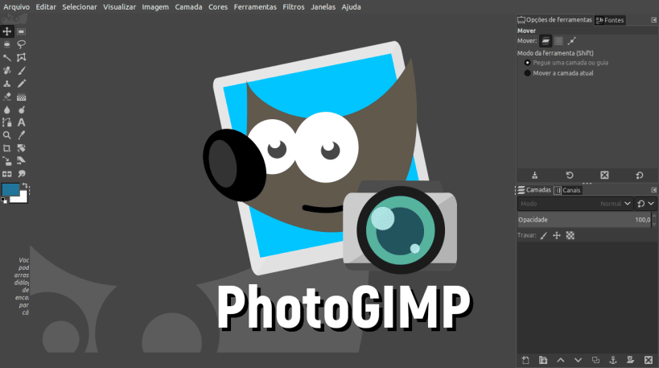

<h1 align="center">
  
  <br/>
  PhotoGIMP - O GIMP para quem vem do Photoshop
  <a href="https://snapcraft.io/photogimp"> <br/> </a>
</h1>

## O que é o PhotoGIMP?

Patch que facilita a vida de quem está migrando do ecossistema da Adobe, com o Photoshop, para o GIMP e para quem gosta de um software de edição de imagens simplificado.


## Quais são os requisitos para instalar?
* [snapd](https://snapcraft.io/docs/core/install)

## Como instalar?
```
    sudo snap install photogimp
```

## Capturas de tela

<h1 align="center">
  
  
</h1>

## Créditos:

* [Pedro Marinho](https://github.com/pedroermarinho)

* [Diolinux](https://diolinux.com.br/2018/11/photogimp-v2018-o-gimp-para-quem-vem-do-photoshop.html)

* [Snapcrafters](https://github.com/snapcrafters/gimp)
