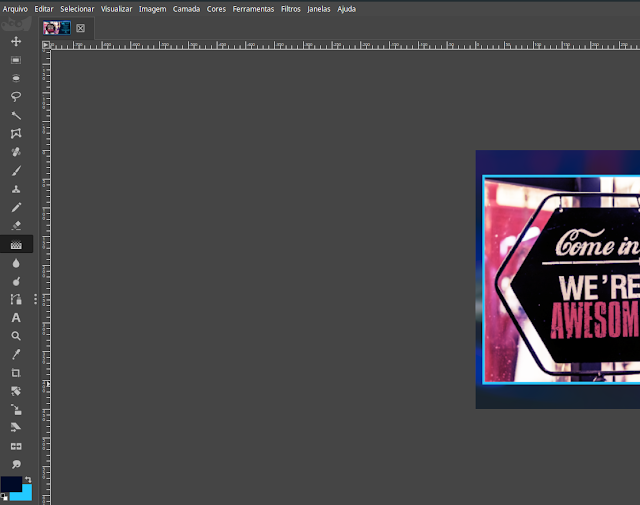

#### Guardando revisão manual da PhotoGIMP versão 2.10.12 (Em breve, estará disponível)

# Creditos:

## Diolinux
### Patch que facilita a vida de quem está migrando do ecossistema da Adobe, com o Photoshop, para o GIMP e para quem gosta de um software de edição de imagens simplificado
([PhotoGIMP v.2018 - O GIMP para quem vem do Photoshop](https://www.diolinux.com.br/2018/11/photogimp-v2018-o-gimp-para-quem-vem-do-photoshop.html))

## Ryu Ketsueki
### Icon 
([Alguém: “Não tem Creative Suite para Linux” - Eu: “Hold my Beer”](https://plus.diolinux.com.br/t/alguem-nao-tem-creative-suite-para-linux-eu-hold-my-beer/8467))

## Snapcrafters
### Gimp
([Programa de Manipulação de Imagem GNU](https://github.com/snapcrafters/gimp))

<h1 align="center">
   
   
   
  
   
  PhotoGIMP v.2018 - O GIMP para quem vem do Photoshop
   
   
   
</h1>

## Install

    sudo snap install photogimp

([Don't have snapd installed?](https://snapcraft.io/docs/core/install))
 
 
 
([Caso ainda não esteja disponivel na snap story baixe aqui!!!](https://github.com/pedroermarinho/photogimp/releases/download/2.10.12/photogimp.snap))
#### Comando de instalação
## Install

    sudo snap install --devmode --dangerous photogimp.snap

<h1 align="center">
  
</h1>

